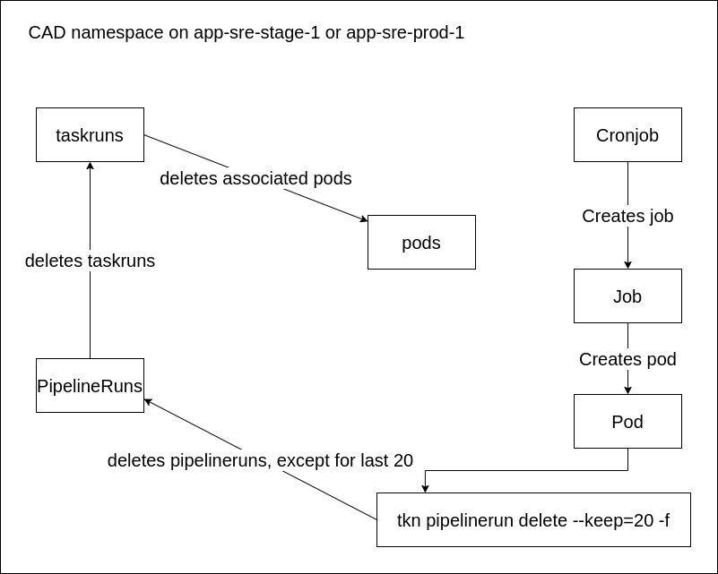

# PipelinePruning

## Overview

Prior, we have exploited the AppSRE pipeline pruning via importing their pipeline defaults in service/app-interface.
This has been changed, because it had a few disadvantages. For instance, we have also imported resource constraints
and other defaults that we do not want for our pipeline.

Instead, we are now using our own PipelinePruner in form of a Cronjob. This Cronjob is defined in [template.yaml](template.yaml).
The Cronjob creates a pod with the following command: `tkn pipelinerun delete --keep=20 -f`.
This command will delete all PipelineRuns except for the last 20.

For doing this, the cronjob needs permissions, these permissions are set in a role, defined in  [template.yaml](template.yaml) as well.

Note, that we have also defined a ResourceQuota that limits the PipelineRuns to a maximum number of 100.
